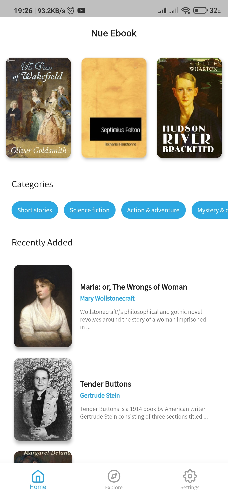
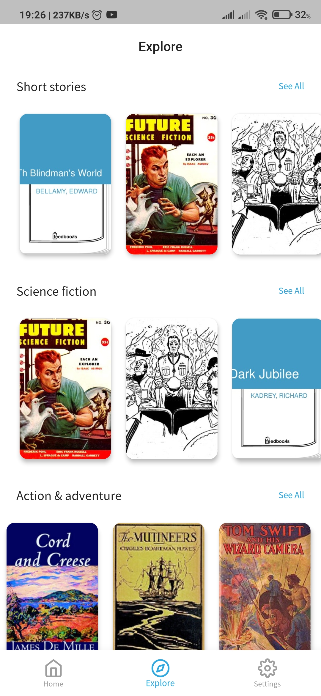
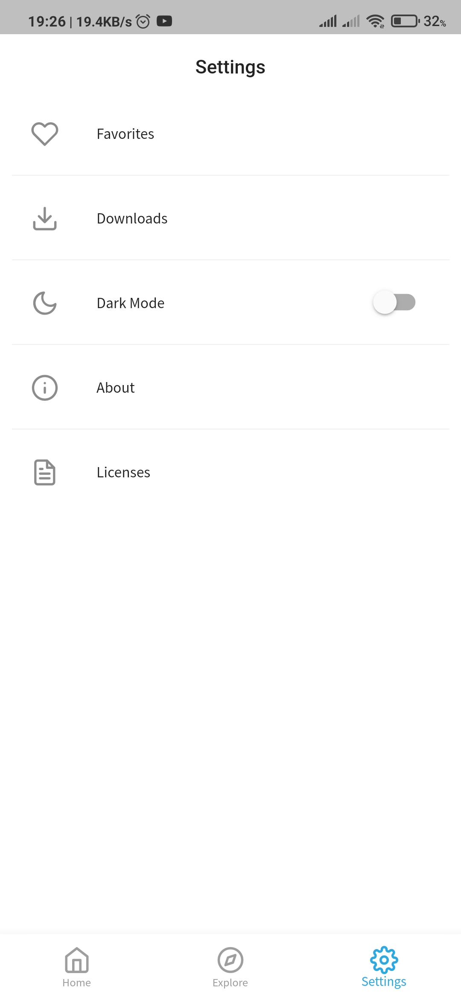

# **Nue eBook**
A Flutter Ebook App.

A simple Flutter app to Read and Download books. The Books included in the app
are from the [Public Domain](https://en.wikipedia.org/wiki/Public_domain)
(Expired Copyright and completely free).

 

The [Feedbooks API](http://www.feedbooks.com/api) was used to fetch books.   

## ScreenShots
---

  

 

 